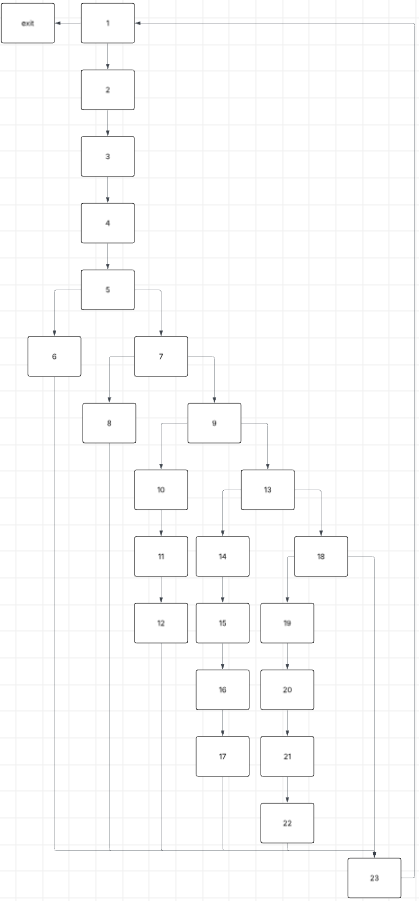
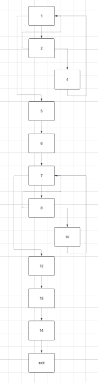

### Equivalence Partitioning - Student Module

| Category | Class | Description | Example |
|----------|------|-------------|---------|
| Grade | G1 | 1 ≤ grade ≤ 10 (valid) | 7 |
| Grade | G2 | grade < 1 (invalid) | -3 |
| Grade | G3 | grade > 10 (invalid) | 15 |
| List size | L1 | 0–6 grades | [5,6,7] |
| List size | L2 | 7 grades (limit) | 7 values |
| List size | L3 | >7 grades | 8+ values |
| Average | A1 | empty list | [] |
| Average | A2 | non-empty list | [5,6,7] |
| Letter Grade | LG1 | avg ≥ 9 | A |
| Letter Grade | LG2 | 8 ≤ avg < 9 | B |
| Letter Grade | LG3 | 7 ≤ avg < 8 | C |
| Letter Grade | LG4 | 5 ≤ avg < 7 | D |
| Letter Grade | LG5 | avg < 5 | F |
| Passing | P1 | avg ≥ 5 | True |
| Passing | P2 | avg < 5 | False |

---

### Equivalence Partitioning - Test Cases

| Test ID | Input | Expected Output |
|----------|------|----------------|
| EP1 | add_grade(7) | accepted |
| EP2 | add_grade(-1) | ValueError |
| EP3 | add_grade(11) | ValueError |
| EP4 | [] | average = 0 |
| EP5 | [5,6,7] | average = 6 |
| EP6 | [9,9,9] | A |
| EP7 | [8,8,8] | B |
| EP8 | [7,7,7] | C |
| EP9 | [5,5,5] | D |
| EP10 | [4,4,4] | F |
| EP11 | avg ≥ 5 | is_passing = True |
| EP12 | avg < 5 | is_passing = False |

---

### Boundary Value Analysis - Student Module

| Feature | Boundary | Values | Expected |
|----------|---------|--------|----------|
| Grade | lower invalid | 0 | Error |
| Grade | lower valid | 1 | OK |
| Grade | upper valid | 10 | OK |
| Grade | upper invalid | 11 | Error |
| List size | near max | 6 | OK |
| List size | max | 7 | OK |
| List size | overflow | 8 | Error |
| Letter grade | A threshold | 9 | A |
| Letter grade | B threshold | 8 | B |
| Letter grade | C threshold | 7 | C |
| Letter grade | D threshold | 5 | D |
| Letter grade | F threshold | 4.99 | F |
| Passing | boundary false | 4.99 | False |
| Passing | boundary true | 5 | True |

---

### Boundary Test Cases

| Test ID | Input | Expected |
|----------|------|----------|
| BV1 | add_grade(0) | ValueError |
| BV2 | add_grade(1) | OK |
| BV3 | add_grade(10) | OK |
| BV4 | add_grade(11) | ValueError |
| BV5 | 7 grades | OK |
| BV6 | 8th grade | ValueError |
| BV7 | [4.97, 5, 5] | F |
| BV8 | [5, 5, 5] | D |
| BV9 | [6.97, 7, 7] | D |
| BV10 | [7, 7, 7] | C |
| BV11 | [7.97, 8, 8] | C |
| BV12 | [8, 8, 8] | B |
| BV13 | [8.97, 9, 9] | B |
| BV14 | [9, 9, 9] | A |
| BV15 | [4.97, 5, 5] | is_passing = False |
| BV16 | [5, 5, 5] | is_passing = True |

---

### Category Partitioning - Filter Functionality

| Category | Class | Description | Condition |
|----------|------|-------------|----------|
| Interval | I1 | valid interval | min ≤ max |
| Interval | I2 | invalid interval | min > max |
| Average Position | AP1 | below interval | avg < min |
| Average Position | AP2 | inside interval | min ≤ avg ≤ max |
| Average Position | AP3 | above interval | avg > max |
| Boundary | B1 | avg = min | lower boundary |
| Boundary | B2 | avg = max | upper boundary |
| Students | S1 | empty list | no students |
| Students | S2 | one student | single case |
| Students | S3 | multiple students | mixed values |

---

### Category Partitioning - Test Cases

| Test ID | Categories Covered | Input | Expected Output |
|----------|------------------|------|----------------|
| CP1 | I1 + AP2 + S2 | [6,6], range(5,7) | student included |
| CP2 | I1 + AP1 + S2 | [4,4], range(5,7) | empty result |
| CP3 | I1 + AP3 + S2 | [9,9], range(5,7) | empty result |
| CP4 | I1 + B1 + S2 | [5,5], range(5,7) | included |
| CP5 | I1 + B2 + S2 | [7,7], range(5,7) | included |
| CP6 | I2 | range(7,5) | ValueError |
| CP7 | I1 + S3 + AP1/AP2/AP3 | mixed students | only valid returned |
| CP8 | I1 + S1 | empty list | empty result |

---

### Independent Circuits Coverage - Student Report Module

---

## Control Flow Graph (CFG)

Nodes:

1. Start  
2. if students list empty  
3. return "NO_DATA"  
4. loop over students  
5. compute average  
6. if passing student  
7. increment passing  
8. if top student  
9. update top student  
10. compute global average  
11. if avg >= 8 (HIGH)  
12. else if avg >= 5 (MEDIUM)  
13. else (LOW)  
14. return report  

CFG (text form):

1 → 2 → (3 or 4)
3 → END
4 → 5 → 6 → (7)
6 → (8)
8 → (9)
loop back to 4
4 → 10 → 11 → 12 → 13 → 14

---

## Cyclomatic Complexity (McCabe)

Using formula:

V(G) = e − n + 2

Where:
- n = 14 nodes
- e = 16 edges (approx. from CFG)

V(G) = 16 − 14 + 2 = 4

➡ Number of independent circuits = 4

---

## Independent Circuits (Basis Paths)

| Circuit ID | Path | Description |
|------------|------|-------------|
| C1 | 1 → 2 → 3 | Empty dataset → NO_DATA return |
| C2 | 1 → 2 → 4 → 10 → 14 | Single/multiple students, normal execution |
| C3 | loop with passing + non-passing students | triggers passing branch |
| C4 | top student update + HIGH performance path | max avg + classification |

---

## Test Mapping

| Test ID | Circuit |
|----------|--------|
| test_C1_empty_data | C1 |
| test_C2_basic_execution | C2 |
| test_C3_passing_students | C3 |
| test_C4_performance_and_top | C4 |

---

### Statement Coverage Tests

ui.menu statemnt graph

| Input | Expected Output | Statements Covered |
|-------|----------------|--------------------|
| "0\n" | program exit | 1...5,6,23 |
| "1\n" | student list printed | 1...5,7,8,23 |
| "2\n" | format message | 1...5,7,9...12,23 |
| "3\n" | student list + prompt | 1...5,7,9,13...17,23 |
| "4\n" | format message | 1...5,7,9,13,18...23 |
| "5\n" | report generated | 1...5,7,9,13,19...22,23 |
| "6 valid" | filtered students printed | 1...5,7,9,13,24...35 |
| "6 empty result" | No students found | 1...5,7,9,13,24...35 |
| "6 invalid input" | error message | 1...5,7,9,13,24...35 |

### Condition Coverage Tests

ui.add_student

| Decisions | Conditions |
|-----------|------------|
| for i in range(len(in_string)): | i < len(in_string) |
| if is_number(in_string[i]): | is_number(in_string[i])
| if not is_number(in_string[i]): | not is_number(in_string[i]) |

| Input | Expected | Decisions |
|-------|--------|------------|
| "" | \<value error>  | i < len(in_string) False |
| "1" | \<value error> | i < len(in_string) True, i < len(in_string) False, is_number(in_string[0]): True, |
| "nume" | \<student created> | i < len(in_string) True, i < len(in_string) False, is_number(in_string[0]): False, |
| "nume 1" | \<student created with grades> | i < len(in_string) True, i < len(in_string) False, is_number(in_string[0]): False, is_number(in_string[i]): True, |