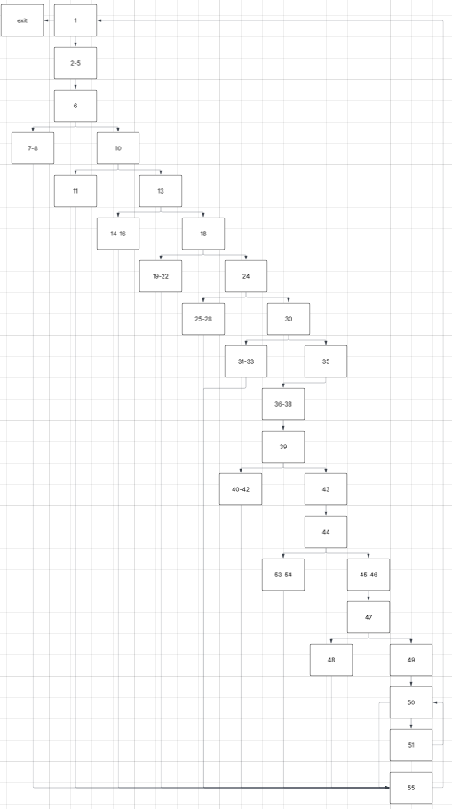
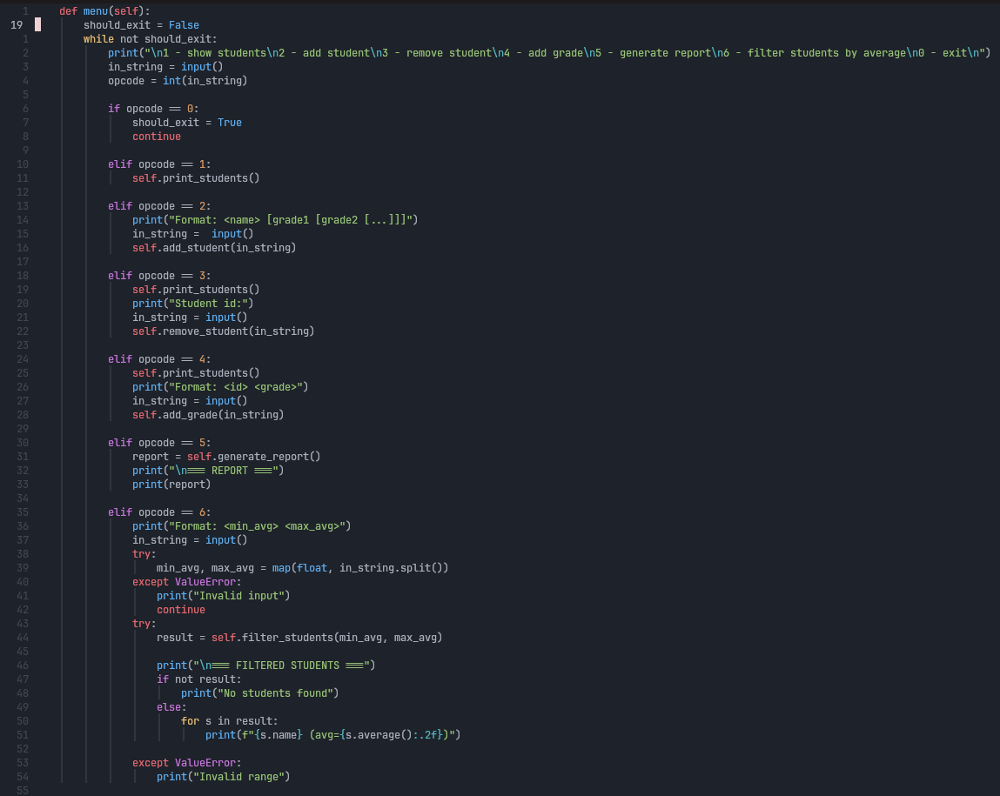
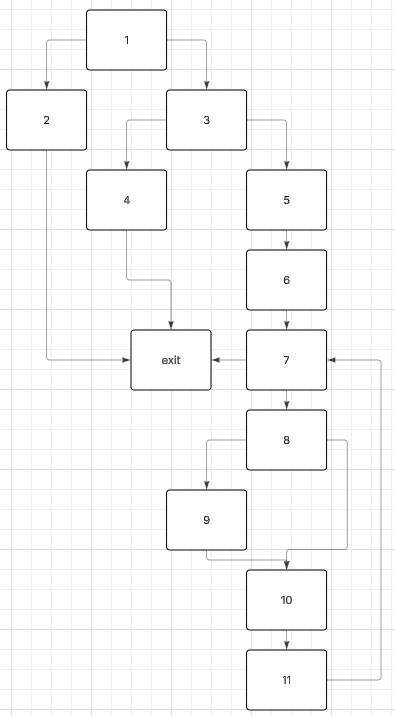
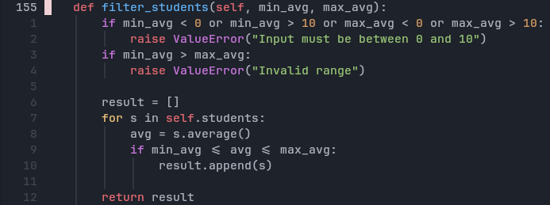
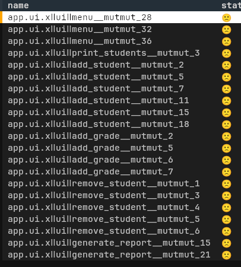
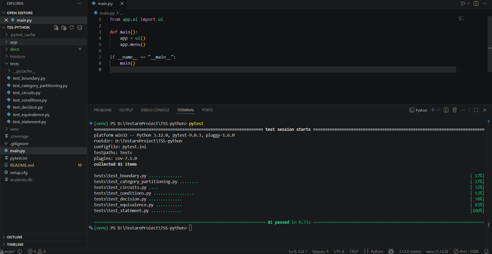
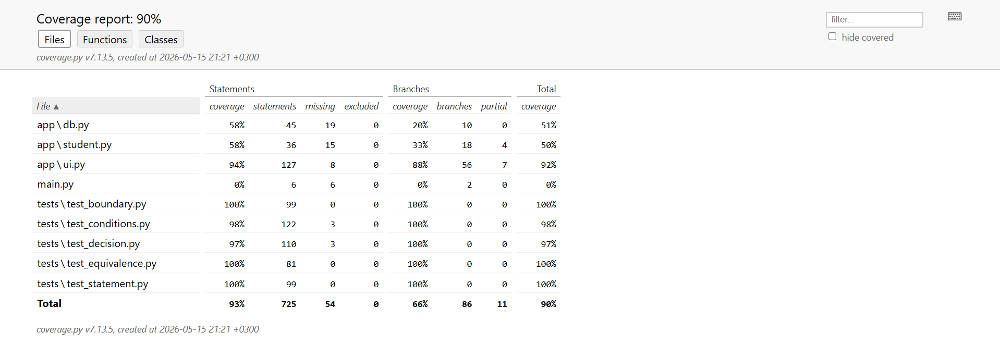
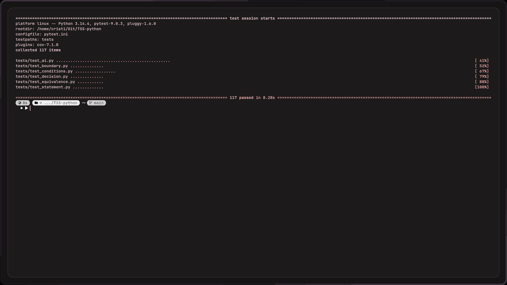

## Descriere generală a aplicației

Proiectul constă într-o aplicație de tip consolă pentru gestionarea unei evidențe simple de studenți și note. Prin intermediul meniului, utilizatorul poate adăuga studenți, poate introduce note, poate șterge înregistrări și poate vizualiza lista existentă. Pe lângă administrarea datelor, aplicația oferă și informații utile despre rezultatele academice. Aceasta calculează mediile studenților, poate genera un raport general asupra performanței și permite filtrarea studenților în funcție de un interval al mediei.

## Configurația hardware

Proiectul a fost dezvoltat și testat pe două sisteme diferite, corespunzătoare membrilor echipei. Ambele sisteme au avut configurații suficiente pentru rularea aplicației fără probleme de performanță:

### Sistem 1:
- Procesor: Intel Core I7-12700H
- Memorie RAM: 16 GB
- Spațiu de stocare: SSD
- Sistem de operare: Windows 11 Pro

### Sistem 2:
- Procesor: Ryzen 7 5700U
- Memorie RAM: 16 GB
- Spațiu de stocare: 512 GB SSD 
- Sistem de operare: linux-7.0.3-1-cachyos

Aplicația nu are cerințe hardware ridicate, fiind compatibilă cu majoritatea sistemelor moderne. Testarea pe două medii diferite a contribuit la verificarea portabilității și consistenței comportamentului aplicației.

## Configurația software
- Limbaj de programare: Python 
- Bază de date: SQLite
- Framework de testare: pytest
- Măsurarea acoperirii codului: pytest-cov
- Tool pentru testare mutațională: mutmut
- Mediu de dezvoltare: Visual Studio Code

## Utilizarea unei mașini virtuale

În cadrul proiectului nu a fost utilizată o mașină virtuală. În schimb, s-a folosit un virtual environment (venv) pentru Python, cu scopul de a izola dependențele proiectului și a evita conflictele cu alte pachete instalate la nivel global.

## Strategii

### Partiționare de echivalență

Pentru împărțire în clase de echivalență a funcției ui.menu trebuie să identificăm mai întâi domeniul de intrări. Funcția funcționează prin citirea unui număr întreg care selectează operația și ulterior alte date sau nu în funcție de operație, astfel avem următoarele clase: 
- pentru numerele de la 0 la 6 fiecare are o clasă
- pentru orice alt număr o clasă

| Intrare | Ieșire |
|---------|--------|
| 0 | ieșire din program |
| 1 | afișare studenți |
| 2 | adăugare student |
| 3 | ștergere student |
| 4 | adăugare notă student |
| 5 | generare raport |
| 6 | filtru studenți |
| 7 | intrare ignorată |

Pentru funcția ui.filter_students am identificat următoarele clase de echivalență:
- intrare validă pentru numere de la 0 la 10 cu min < max
- intrare invalidă pentru numere mai mici ca 0
- intrare invalidă pentru numere mai mari ca 10
- intrare invalidă pentru minim mai mare ca maxim

| Intrare | Ieșire |
|---------|--------|
| 4 6 | listă studenți |
| -1 2 | număr invalid |
| 2 11 | număr invalid |
| 6 4 | interval invalid |

--------------------------------------------------
### Analiza valorilor de frontieră

| Intrare | Ieșire |
|---------|--------|
| -1 | intrare ignorată |
| 0 | ieșire din program |
| 1 | afișare studenți |
| 2 | adăugare student |
| 3 | ștergere student |
| 4 | adăugare notă student |
| 5 | generare raport |
| 6 | filtru studenți |
| 7 | intrare ignorată |

| Intrare | Ieșire |
|---------|--------|
| 0 0 | listă studenți |
| 10 10 | listă studenți |
| 11 11 | număr invalid |
| -1 -1 | număr invalid |
| 1 0 | interval invalid |

--------------------------------------------------
### Acoperire la nivel de instrucțiune

Pentru testarea la nivel de instrucțiune primul pas este transformarea programului într-un graf orientat (graful din stânga este graful pentru funcția ui.menu, cel din dreapta este pentru funcția ui.filter_students)

Pentru a obține un set de teste care acoperă toate instrucțiunile din funcția ui.menu folosim graful orientat corespunzător pentru a identifica un set de date care în urma rulării atinge fiecare instrucțiune cel puțin o dată. În urma analizei grafului am obținut setul următor de teste:

| Intrare | Ieșire așteptată | Instrucțiuni acoperite |
|-------|----------------|--------------------|
| "0" | ieșire din program | 1...8,55 |
| "1" | listă studenți afișată | 1...6,11,55 |
| "2" | mesaj format | 1...6,11,13,14...16,55 |
| "3" | listă studenți + prompt | 1...6,11,13,18,19...22,55 |
| "4" | mesaj format | 1...6,11,13,18,24,25...28,55 |
| "5" | raport generat | 1...6,11,13,18,24,30,31...3355 |
| "6 input invalid" | mesaj eroare | 1...6,11,13,18,24,30,35,36...38,39,40...42,55 |
| "6 valid" | studenți filtrați afișați | 1...6,11,13,18,24,30,35,36...38,39,43,44,53...5455 |
| "6 rezultat gol" | niciun student găsit | 1...6,11,13,18,24,30,35,36...38,39,43,44,54...46,47,48,55 |
| "6 interval invalid" | mesaj eroare | 1...6,11,13,18,24,30,35,36...38,39,43,44,54...46,47,50,51,55 |

Aceeași metodă este folosită și pentru funcția ui.filter_students pentru a obține acest set de date.

| Intrare | Ieșire așteptată | Instrucțiuni acoperite |
|-------|----------------|--------------------|
| -1 2 | eroare valoare | 1,2 |
| 6 4 | eroare valoare | 1,3,4 |
| 4 6 | listă studenți | 1,3,5-11 |

--------------------------------------------------
### Acoperire la nivel de decizie

Pentru testare la nivel de decizie analizăm programul și graful orientat al acestuia pentru a extrage instrucțiunile de decizie (if, for, while, try except) în ui.menu am găsit următoarele decizii

| Nr | Decizii |
|----|-----------|
| 1 | while not should_exit |
| 2 | if opcode == 0 |
| 3 | if opcode == 1 |
| 4 | if opcode == 2 |
| 5 | if opcode == 3 |
| 6 | if opcode == 4 |
| 7 | if opcode == 5 |
| 8 | if opcode == 6 |
| 9 | try map(float, in_string.split()) |
| 10 | try self.filter_students(min_avg, max_avg) |
| 11 | if not result |
| 12 | for s in result |

Setul de date de test următor a fost ales astfel încât fiecare dintre cele 12 decizii să fie cel puțin o dată adevărate și o dată false

| Intrare | Ieșire | Decizii |
|-------|--------|-----------|
| 0 | ieșire din program | 1 True False, 2 True |
| 1 | listă studenți afișată | 1 True, 2 False, 3 True|
| 2 | mesaj format | 1 True, 2-3 False, 4 True |
| 3 | listă studenți + prompt | 1 True, 2-4 False, 5 True |
| 4 | mesaj format | 1 True, 2-5 False, 6 True |
| 5 | raport generat | 1 True, 2-6 False, 7 True |
| 6 "input invalid" | mesaj eroare | 1 True False, 2-7 False, 8 True, 9 False |
| 6 "valid" | studenți filtrați afișați | 1 True, 2-7 False, 8 True, 9 True, 10 True, 11 False, 12 True False |
| 6 "rezultat gol" | niciun student găsit | 1 True, 2-7 False, 8 True, 9 True 10 True, 11 True |
| 6 "interval invalid" | mesaj eroare | 1 True, 2-7 False, 8 True, 9 True, 10 False |
| 7 | input ignorat așteaptă altă operație | 1 True, 2-8 False |

Aceeași metodă a fost utilizată pentru funcția ui.filter_students

| Nr | Decizii |
|----|-----------|
| 1 | if min_avg < 0 or min_avg > 10 or max_avg < 0 or max_avg > 10 |
| 2 | if min_avg > max_avg: |
| 3 | for s in self.students: |
| 4 | if min_avg <= avg <= max_avg: |

| Intrare | Ieșire | Decizii |
|-------|--------|-----------|
| -1 2 | eroare valoare | 1 True |
| 6 4 | eroare valoare | 1 False, 2 True |
| 4 6 (student cu medie în interval) | listă studenți | 1 False, 2 False, 3 True False, 4 True |
| 1 2 (student în afara intervalului) | listă studenți | 1 False, 2 False, 3 True False, 4 False |

--------------------------------------------------
### Acoperire la nivel de condiție

Pentru testare la nivel de condiție împărțim deciziile identificate anterior în mai multe condiții (dacă este posibil).

| Nr | Decizii | Condiții |
|----|-----------|------------|
| 1 | while not should_exit | not should_exit |
| 2 | if opcode == 0 | opcode == 0 |
| 3 | if opcode == 1 | opcode == 1 |
| 4 | if opcode == 2 | opcode == 2 |
| 5 | if opcode == 3 | opcode == 3 |
| 6 | if opcode == 4 | opcode == 4 |
| 7 | if opcode == 5 | opcode == 5 |
| 8 | if opcode == 6 | opcode == 6 |
| 9 | try map(float, in_string.split()) | map(float, in_string.split()) aruncă excepție |
| 10 | try self.filter_students(min_avg, max_avg) | self.filter_students(min_avg, max_avg) aruncă excepție |
| 11 | if not result | not result |
| 12 | for s in result | s in result |

Cum deciziile din funcția ui.menu nu pot fi împărțite în mai multe condiții setul de teste găsit este identic cu cel de la testare la nivel de decizie

| Intrare | Ieșire așteptată | Condiții |
|-------|----------|------------|
| 0 | ieșire din program | 1 True False, 2 True |
| 1 | listă studenți afișată | 1 True, 2 False, 3 True|
| 2 | mesaj format | 1 True, 2-3 False, 4 True |
| 3 | listă studenți + prompt | 1 True, 2-4 False, 5 True |
| 4 | mesaj format | 1 True, 2-5 False, 6 True |
| 5 | raport generat | 1 True, 2-6 False, 7 True |
| 6 "input invalid" | mesaj eroare | 1 True False, 2-7 False, 8 True, 9 False |
| 6 "valid" | studenți filtrați afișați | 1 True, 2-7 False, 8 True, 9 True, 10 True, 11 False, 12 True False |
| 6 "rezultat gol" | niciun student găsit | 1 True, 2-7 False, 8 True, 9 True 10 True, 11 True |
| 6 "interval invalid" | mesaj eroare | 1 True, 2-7 False, 8 True, 9 True, 10 False |
| 7 | input ignorat așteaptă altă operație | 1 True, 2-8 False |

În funcția ui.filter_students există mai multe condiții în decizia 3 astfel setul de date de test găsit aici este diferit.

| Nr | Decizii | Condiții |
|----|-----------|------------|
| 1 | if min_avg < 0 or min_avg > 10 or max_avg < 0 or max_avg > 10 | min_avg < 0 |
| 2 | if min_avg < 0 or min_avg > 10 or max_avg < 0 or max_avg > 10 | min_avg > 10 |
| 3 | if min_avg < 0 or min_avg > 10 or max_avg < 0 or max_avg > 10 | max_avg < 0 |
| 4 | if min_avg < 0 or min_avg > 10 or max_avg < 0 or max_avg > 10 | max_avg > 10 |
| 5 | if min_avg > max_avg: | min_avg > max_avg |
| 6 | for s in self.students: | s in self.students |
| 7 | if min_avg <= avg <= max_avg: | min_avg <= avg |
| 8 | if min_avg <= avg <= max_avg: | avg <= max_avg |

| Intrare | Ieșire | Decizii |
|-------|--------|-----------|
| -1 2 | eroare valoare | 1 True |
| 11 2 | eroare valoare | 2 True |
| 2 -1 | eroare valoare | 3 True |
| 2 11 | eroare valoare | 4 True |
| 6 4 | eroare valoare | 1-4 False 5 True |
| 1 2 (student peste interval) | listă studenți | 1-4 False 5 False, 6 True False, 7 True, 8 False |
| 9 10 (student sub interval) | listă studenți | 1-4 False 5 False, 6 True False, 7 False, 8 True |

--------------------------------------------------
### Mutation testing

Testarea la nivel de mutații pentru cele două funcții ui.menu și ui.filter_students a fost realizată cu unealta mutmut. După utilizarea acesteia am găsit următoarele rezultate:
- pentru ui.menu singurii mutanti neeliminati sunt cei care adauga caractere dupa sau inainte de string-urile pentru meniu (nu afecteaza functionarea doar aspectul)
- pentru ui.filter_students nu avem mutanti neeliminati

## Rulare teste si coverage

Comanda pentru coverage cu raport HTML: pytest --cov=. --cov-branch --cov-report=html --cov-report=term-missing

## Prezentare

Prezentarea proiectului este disponibilă aici:

[Download PowerPoint](./docs/Prezentare.pptx)

## Raport utilizare tool-uri AI

Pentru a testa dacă tool-urile AI pot fi folositoare la dezvoltarea și extinderea unei suite de teste, am utilizat modelul GPT-5.4 Thinking pentru a genera o suită de teste echivalentă cu cea dezvoltată.

Folosind promptul: "
creaza o suita de teste completa pnetru functiile ui.menu si ui.filter_students. Suita de teste trebuie sa includa teste functionale (equvalence partitioning, boundry value analysis si category partitioning) cat si teste structurale (statement coverage, decision coverage si condition coverage) pentru fiecare tip de test scrie un scurt raport care sa evidentieze ce teste au fost create si care dintre ele sunt noi.
"

Conversația întreagă:: https://chatgpt.com/share/6a088732-7444-83eb-8dcd-45b5cf487ad1

După o analiză a testelor generate, am observat următoarele diferențe:
- pentru funcția ui.filter_students
    - este adăugată o clasă de echivalență în plus (interval valid care include toate mediile)
    - este ignorată o decizie în condition coverage (if min_avg <= avg <= max_avg), astfel nu este realizat complet condition coverage
- pentru ui.menu 
    - clasele de echivalență sunt total diferite (sunt bazate pe inputuri valide/invalide în loc de operația executată)
    - statement coverage nu include teste pentru toate instrucțiunile (lipsesc teste pentru excepțiile posibile în ultima operație)
    - decision coverage are o multitudine de teste lipsă (există teste doar pentru ultima operație)
    - condition coverage nu include teste pentru excepții

Per total, utilizarea tool-urilor AI poate ajuta la dezvoltarea rapidă a unei suite de teste, dar acestea au tendința de a ignora anumite părți, în special în cazul testelor structurale. 

Rularea testelor AI și non-AI

## Referințe

[1] OpenAI, ChatGPT, https://chatgpt.com/, Data accesării: aprilie-mai 2026

[2] pytest Documentation, https://docs.pytest.org/, Data accesării: aprilie-mai 2026

[3] mutmut Documentation, https://mutmut.readthedocs.io/, Data accesării: aprilie-mai 2026

[4] coverage.py Documentation, https://coverage.readthedocs.io/, Data accesării: aprilie-mai 2026
